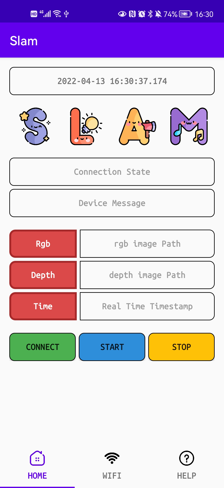
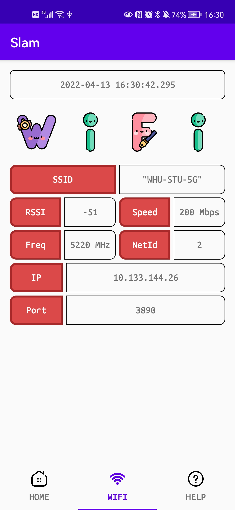
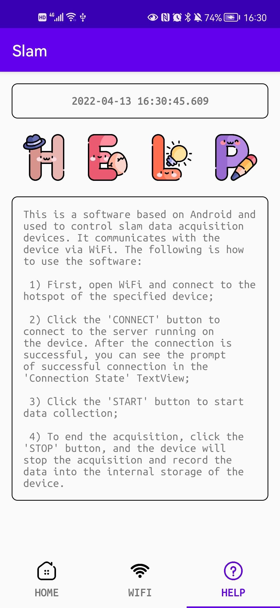
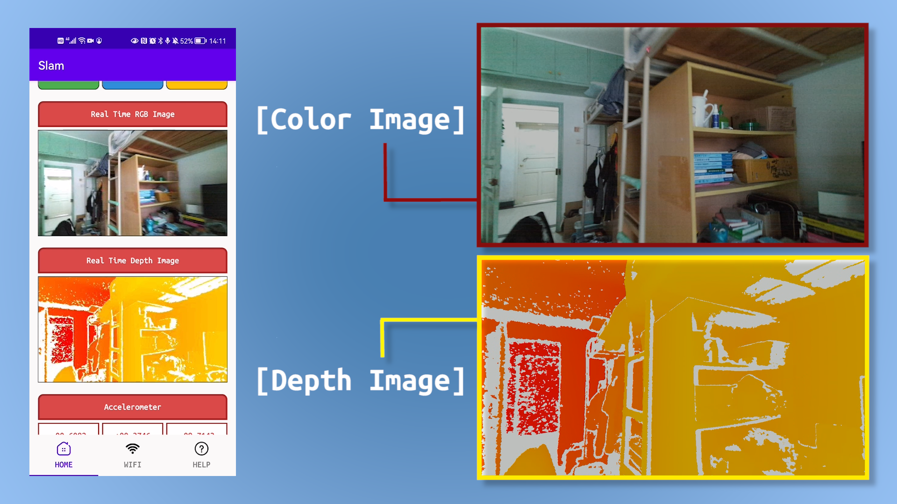
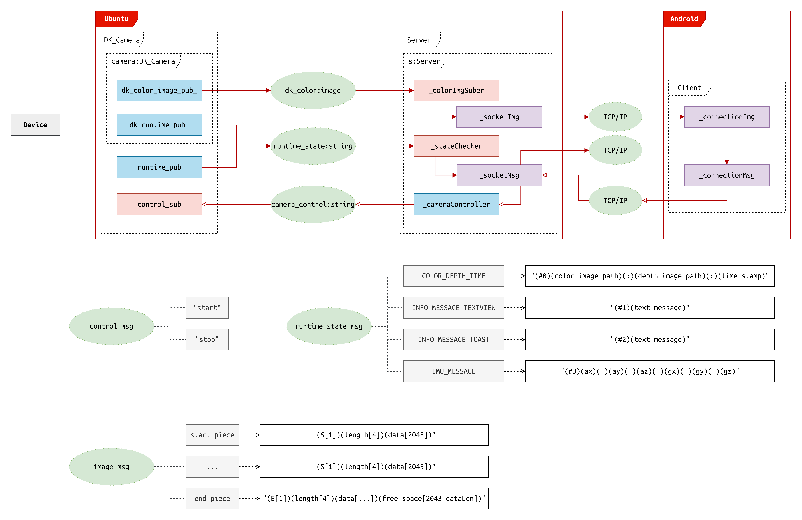

# Collector Controller
___Author: csl___

___E-Mail: 3079625093@qq.com___

[TOC]

# 1. Overview

This is a software based on Android and used to control slam data acquisition devices.
It communicates with the device via WiFi. The following is how to use the software:

1) First, open WiFi and connect to the hotspot of the specified device;
2) Click the 'CONNECT' button to connect to the server running on the device.
    After the connection is successful, you can see the prompt of successful connection in the 'Connection State' TextView;
3) Click the 'START' button to start data collection;
4) To end the acquisition, click the 'STOP' button, and the device will stop the acquisition and record the data
    into the internal storage of the device.

# 2. Tips

1) Double click the 'Local-Time' textview if you want to clear the text in textviews.;
1) When collecting data, 'slam' pictures will dance. Yes, they are greeting you!

# 3. Develpoers

**ShuolongChen: 3079625093@qq.com**

**ZiruiWang: 1298036718@qq.com**

**YehaoZhao: 1163810660@qq.com**

**QuanfeiWang: 871816589@qq.com**

# 4. Demo

### 1. images

### 2. video

Here is the link: [https://www.bilibili.com/video/BV1qr4y187ww/](https://www.bilibili.com/video/BV1qr4y187ww/)

# 5. Project Structure

